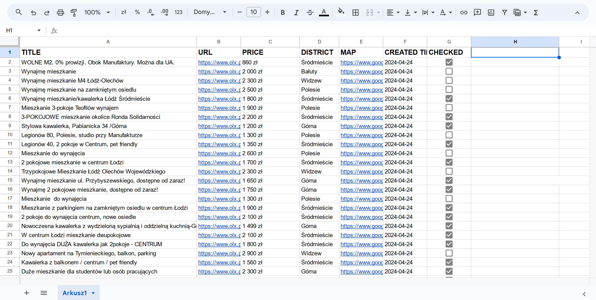

[![Contributors][contributors-shield]][contributors-url]
[![Forks][forks-shield]][forks-url]
[![Stargazers][stars-shield]][stars-url]
[![Issues][issues-shield]][issues-url]
[![MIT License][license-shield]][license-url]
[![LinkedIn][linkedin-shield]][linkedin-url]


<br />
<div align="center">
  <h3 align="center">olx-rent</h3>

  <p align="center">
    Script to scrape property offers from olx.pl and save them to Google Sheet 
    <br />
    <br />
    <a href="https://github.com/DEENUU1/olx-rent/issues">Report Bug</a>
    ·
    <a href="https://github.com/DEENUU1/olx-rent/issues">Request Feature</a>
  </p>
</div>




## Technologies:
- Python
  - Requests
- Google Sheet

## Installation

#### Clone repository
```bash
git clone https://github.com/DEENUU1/job-scraper.git
```

#### Set up your Google Account
1. Go to <a href="https://console.cloud.google.com/welcome?project=private-418116">Google Console</a>
2. Create or choose existing project <a href="https://developers.google.com/workspace/guides/create-project?hl=pl">Tutorial</a>
3. Go to Navigation Menu and select APIs & Services and then Credentials
4. Click CREATE CREDENTIALS and choose Service Account
5. Give some random name and click Done
6. Copy e-mail of the created account
7. Then click on the pencil button to the left of the trash icon
8. Go to Keys and click ADD KEY and then Create new key
9. Choose JSON format and then Create 
10. Rename downloaded file to `credentials.json` and copy it to the main direction of this project (the same directory where main.py is located)
11. <a href="https://console.cloud.google.com/marketplace/product/google/sheets.googleapis.com?q=search&referrer=search&project=private-418116" >Go back to Google Console and search for Google Seet API</a>
12. Enable this API
13. Create new Google Sheet 
14. In Google Sheet click on Share and copy here the email you copied earlier
15. Choose access for all people with link and copy this link

#### How to get olx url

1. First you need to go to https://www.olx.pl/nieruchomosci/ and choose all filters that you need 
2. Then click the right mouse button and go to Devtools
3. Go to Network tab and refresh the page
4. Scroll to the end and go to page 2 (pagination)
5. Scroll to the end again and now in the Network tab search for a JSON with url like this "https://www.olx.pl/api/v1/offers/?offset=40&...."
6. In my example it looks like this https://www.olx.pl/api/v1/offers?offset=0&limit=40&category_id=15&region_id=7&city_id=10609&sort_by=created_at%3Adesc&filter_enum_furniture%5B0%5D=yes&filter_float_price%3Ato=3000&filter_refiners=spell_checker&sl=18c34ade124x23bc10a5
7. Then click links and go to previous 

#### Create .env file
```bash
cp .env_example .env
```

#### Set up .env file
- `OLX_URL` more about it in this section - `HOW TO GET OLX URL`
- `GOOGLE_SHEET_URL` url to Google Sheet file 


#### Create virtual environment
```bash
python3 -m venv venv
```

#### Activate virtual environment
```bash
venv\Scripts\activate
```

#### Run scrapers
```bash
python main.py

# On windows you can run `run.ps1` powershell script
```


## Authors

- [@DEENUU1](https://www.github.com/DEENUU1)

<!-- LICENSE -->

## License

See `LICENSE.txt` for more information.


<!-- MARKDOWN LINKS & IMAGES -->
<!-- https://www.markdownguide.org/basic-syntax/#reference-style-links -->

[contributors-shield]: https://img.shields.io/github/contributors/DEENUU1/olx-rent.svg?style=for-the-badge

[contributors-url]: https://github.com/DEENUU1/olx-rent/graphs/contributors

[forks-shield]: https://img.shields.io/github/forks/DEENUU1/olx-rent.svg?style=for-the-badge

[forks-url]: https://github.com/DEENUU1/olx-rent/network/members

[stars-shield]: https://img.shields.io/github/stars/DEENUU1/olx-rent.svg?style=for-the-badge

[stars-url]: https://github.com/DEENUU1/olx-rent/stargazers

[issues-shield]: https://img.shields.io/github/issues/DEENUU1/olx-rent.svg?style=for-the-badge

[issues-url]: https://github.com/DEENUU1/olx-rent/issues

[license-shield]: https://img.shields.io/github/license/DEENUU1/olx-rent.svg?style=for-the-badge

[license-url]: https://github.com/DEENUU1/olx-rent/blob/master/LICENSE.txt

[linkedin-shield]: https://img.shields.io/badge/-LinkedIn-black.svg?style=for-the-badge&logo=linkedin&colorB=555

[linkedin-url]: https://linkedin.com/in/kacper-wlodarczyk

[basic]: https://github.com/DEENUU1/olx-rent/blob/main/assets/v1_2/basic.gif?raw=true

[full]: https://github.com/DEENUU1/olx-rent/blob/main/assets/v1_2/full.gif?raw=true

[search]: https://github.com/DEENUU1/olx-rent/blob/main/assets/v1_2/search.gif?raw=true
